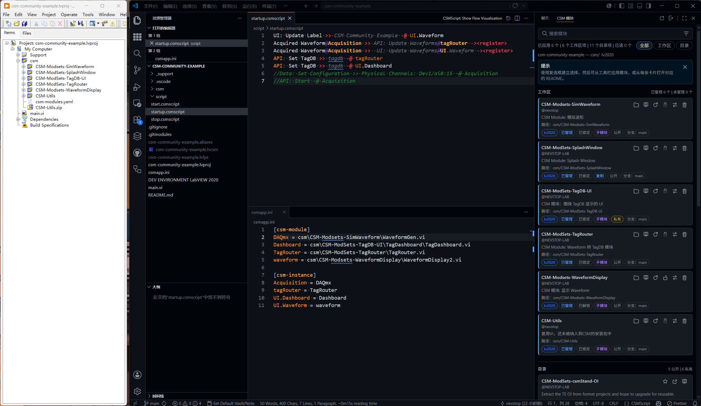

# csm-community-example

配合 [CSM VSCode](https://github.com/NEVSTOP-LAB/csm-vsc-extension) 插件的模块管理功能，完成一个利用社区模块完成复杂任务的示例。

> [!NOTE]
> CSM VSCode 插件在市场中搜索 CSM 即可获取。

- VSCode 插件管理目录下的 csm/ 文件夹，放置社区模块，插件会自动识别并加载。
- LabVIEW 自动发布 csm/ 目录，所有代码都加载到LabVIEW 中。
- VSCode 中可以编写模块和配置信息。
- LabVIEW 编写简单的主程序，调用模块完成任务。

## 📖 详细文档

更多信息请参阅 [使用方法](./_docs/Usage.md) ，包含完整的分步教程、CSM Script 编写指南及常见问题答疑。